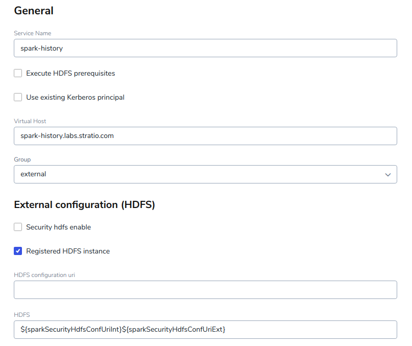
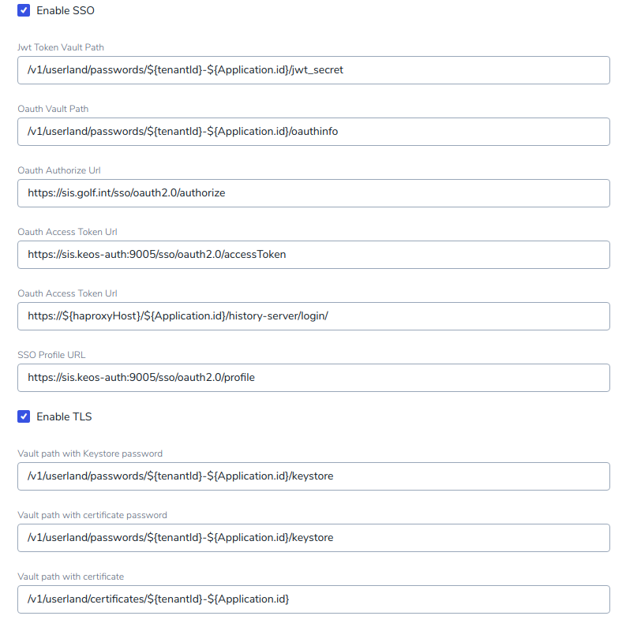
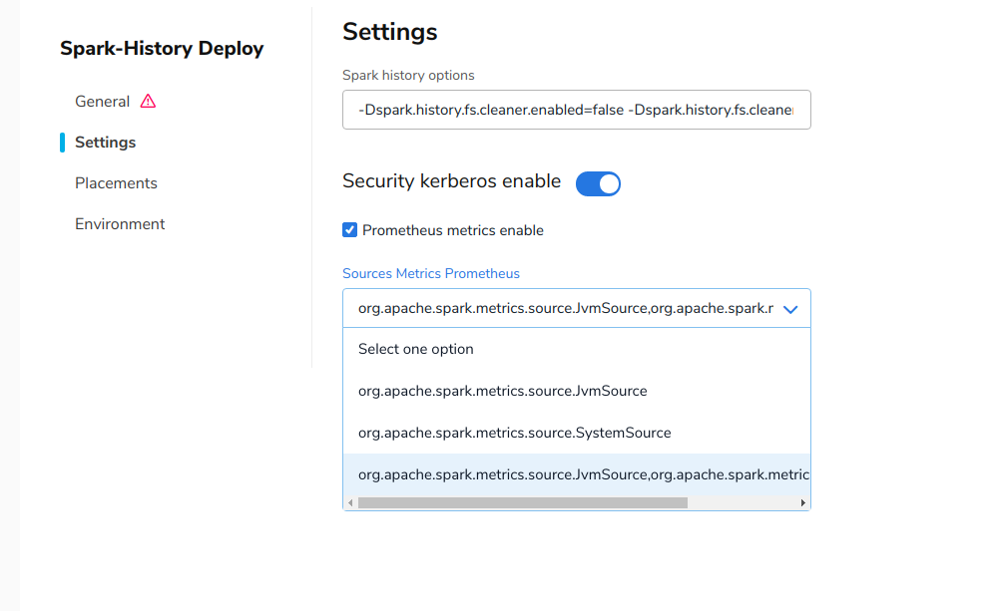

This section explains how a *Stratio EOS* user can install *Spark History Server* using *Stratio Command Center* by following the next steps:

1) Inside *Stratio Command Center*, go to "Add Service" and search for **Spark-History**:


2) Select "Deploy" and fill in the required parameters for a basic installation:

  



3) If you need to customize your deployment, click on "Customize deployment". You will see three sections:

## General

|Property|Description|
|--------|-----------|
|Service ID|Kubernetes deployment name. You can use the period '.' to create the service inside folders.|
|Kerberos principal|the Kerberos principal to use to access HDFS.|
|Virtual Host|Virtual host to be exposed through the _Ingress_ service|
|Registered HDFS instance|Whether the HDFS is internal or external. If selected, the internal HDFS configuration will appear in the selector menu, else you have to define the URI where the config is located.|
|HDFS configuration URI|If registered HDFS is selected, the internal HDFS configuration will appear in the selector menu, else you have to define the URI where the config is located.|
|Logs path|Path where the logs are stored in HDFS.|
|Vault role|Role used to authenticate to Vault.|
|Resources|The number of instances, CPU, memory, and disk to use.|

## Settings

|Property|Description|
|--------|-----------|
|*Spark History Server* options|Spark extra options.|
|Security Kerberos enable|Whether Kerberos is enabled.|

## Environment

Vault properties were obtained from the centralized configuration.

## Tenant

You need to set the environment variable TENANT to deploy *Spark History Server*.

## Metrics

You can monitor the **Spark-History** service and set alarms based on some metrics. You need to activate this feature in `Settings`, and then you can choose the following metric sources:

* **org.apache.spark.metrics.source.JvmSource**: metrics for JVM,
* **org.apache.spark.metrics.source.SystemSource**: metrics for disk, memory, and CPU.



4) If you want to use *Spark History Server*, you need to add these Spark properties into your Spark jobs:
```json
"spark.eventLog.enabled": "true",
"spark.eventLog.dir": "hdfs:/tmp/logs/history"
```

5) If you want to know more about how the *Spark History Server* works, please check the official [Apache Spark History Server documentation](http://spark.apache.org/docs/2.1.0/monitoring.html#viewing-after-the-fact).
