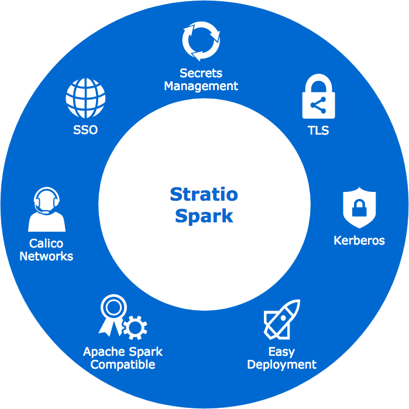

*[itg-glossary glossary-id="12789"]Stratio Spark[/itg-glossary]* offers you the following functionalities expanded from Apache Spark 3.0.0 in Kubernetes:

  * Use dynamic authentication to access secrets that are stored in [itg-glossary glossary-id="12570"]Vault[/itg-glossary].
  * Allow access to Kerberized HDFS.
  * Allow access to PostgreSQL with [itg-glossary glossary-id="13179"]Mutual TLS[/itg-glossary] authentication.
  * SSO in *Spark History Server*: only registered users can see the [itg-glossary glossary-id="12787"]Spark UI[/itg-glossary] saved in the History Server. This allows you to provide secure access to these services and, in the future, is the way to establish policies for the different users of the platform.
  * Fully integrated with Calico (SDN solution).
  * Secret management: easy access to all the secrets stored in Vault for your principal just using environmental variables in your jobs.
  * Easy access to secured data stores: compatible with Kerberized HDFS and with the difference of TLS/password data stores provided by *[itg-glossary glossary-id="11878"]Stratio Augmented Data Fabric[/itg-glossary]*. Just put the path to your secret in the environmental variables, and *Stratio Spark* will provide you a path to your secret downloaded and formatted, or the direct connection to the secured data store.
  * Allow access to *Azure Data Lake Gen2* storage with OAuth security and secrets stored in Vault.
  * Added new metrics that offer you monitoring and alerting capabilities through Prometheus/Grafana.
  * Support for both driver and executor can have different log levels in Stratio format in Kubernetes.
  * Metrics of driver and executors in Prometheus on Kubernetes.
  * Support for Python custom environments on Kubernetes.

  
