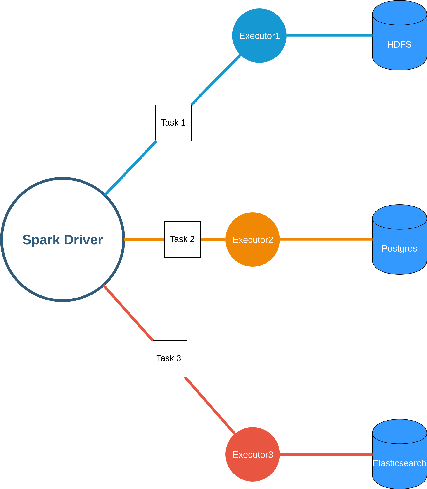

*Stratio Spark* is a unified analytics engine for large-scale data processing. Due to its architecture, it's easy to create java/scala/python programs that will run distributed in your cluster.

Each program developed using Spark will be split into different tasks that the parent process (the [itg-glossary glossary-id="12782"]Spark Driver[/itg-glossary]) will serialize to be executed in the Spark Executors. Once the task is executed by the executor, the result of the task will be returned to the Spark Driver which is in charge of coordinate the results from the different executors, and continue with the execution of the pending tasks.

Using this simple mechanism is how *Stratio Spark* manages all the different functionalities that offer such as SQL queries, Machine Learning, batch processes or distributed streaming process.

Also, the driver is in charge of supervising the number of resources requested for the Spark job and it also will continuously check the status of the executors, killing them or launching news if needed.

