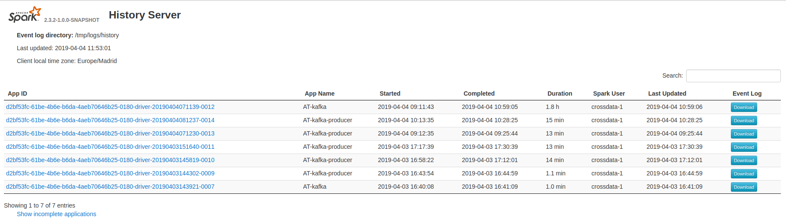

*Spark History Server* is a service that exposes an API to monitor and a web UI to see the *Spark UI* for running or completing applications launched with the event logger enabled.

These logs are read from HDFS, and will only show the jobs that have the event logger enabled.

In order to enable the event logger for your jobs and be able to see the logs in the *Spark History Server*, add the following properties to your **sparkProperties**:

* **spark.eventLog.enabled**: must be set to "true".
* **spark.eventLog.dir**: must be the same path you configured in the property **Logs path** when [deploying *Spark History Server*](../Installing-and-upgrading/Deployment/Spark-History-Server-installation.md).
* **spark.eventLog.filePermission**: by default is 770. Use 755 to give access if the history server is deployed with a different Unix group.

*Example:*
```json
"spark.eventLog.enabled": "true",
"spark.eventLog.dir": "hdfs:///tmp/logs/history"
"spark.eventLog.filePermission": "755"
```

You can configure log rotation (to avoid huge files) by also adding these properties to your **sparkProperties**:

* **spark.eventLog.rotate**: set to "true" if you are planning to run a long job. False by default.
* **spark.eventLog.rotate.num**: number of files that will be used in the log rotation.
* **spark.eventLog.rotate.size**: max size of each log file. The recommended value is 50m. Values higher than 50m could produce files not readable from *Spark History Server*.

*Example:*
```json
"spark.eventLog.rotate": "true",
"spark.eventLog.rotate.num": "2",
"spark.eventLog.rotate.size": "10m",
```

## Web UI

To test the connection, now you can access in your browser **https://SPARK-HS-VIRTUAL-HOST/SERVICE-ID/history-server** (*example* https://spark-hs.labs.stratio.com/spark-history/history-server), and you should see the Stratio login if not logged in, and the web UI if you are logged in.



Here is all the information about the available web UI endpoints:

|Endpoint|Meaning|
|--------|-------|
|/applications|`?status=[completed - running]` list only applications in the chosen state.`?minDate=[date]` earliest date/time to list.Examples:`?minDate=2015-02-10` `?minDate=2015-02-03T16:42:40.000GMT` `?maxDate=[date]` latest date/time to list; uses same format as `minDate`.`?limit=[limit]` limits the number of applications listed.|
|/history/[app-id]/jobs|A list of all jobs for a given application.`?status=[complete-succeeded-failed]list only jobs in the specific state.`|
|/history/[app-id]/jobs/[job-id]| Details for the given job.|
|/history/[app-id]/stages|A list of all stages for a given application.|
|/history/[app-id]/stages/[stage-id]|A list of all attempts for the given stage.`?status=[active-complete-pending-failed] list only stages in the state.`|
|/history/[app-id]/stages/[stage-id]/[stage-attempt-id]|Details for the given stage attempt.|
|/history/[app-id]/stages/[stage-id]/[stage-attempt-id]/taskSummary|Summary metrics of all tasks in the given stage attempt.`?quantiles summarize the metrics with the given quantiles.Example: ?quantiles=0.01,0.5,0.99`.|
|/history/[app-id]/stages/[stage-id]/[stage-attempt-id]/taskList|A list of all tasks for the given stage attempt.`?offset=[offset]&length=[len] list tasks in the given range.`?sortBy=[runtime -runtime] sort the tasks. Example: `?offset=10&length=50&sortBy=runtime`.|
|/history/[app-id]/executors|A list of all active executors for the given application.|
|/history/[app-id]/allexecutors|A list of all(active and dead) executors for the given application.|
|/history/[app-id]/storage/rdd|A list of stored RDDs for the given application.|
|/history/[app-id]/storage/rdd/[rdd-id]|Details for the storage status of a given RDD.|
|/applications/[base-app-id]/logs|Download the event logs for all attempts of the given application as files within a zip file.|
|/applications/[base-app-id]/[attempt-id]/logs|Download the event logs for a specific application attempt as a zip file.|

## API

In addition to the web UI, here is all the information related to the available API endpoints:

| Endpoint | Result |
| -------- | ------ |
| /applications | A list of all applications.`?status=[completed-running]` list only applications in the chosen state.`?minDate=[date]` earliest start date/time to list.`?maxDate=[date]` latest start date/time to list.`?minEndDate=[date]` earliest end date/time to list.`?maxEndDate=[date]` latest end date/time to list.`?limit=[limit]` limits the number of applications listed. Examples:`?minDate=2015-02-10` `?minDate=2015-02-03T16:42:40.000GMT` `?maxDate=2015-02-11T20:41:30.000GMT` `?minEndDate=2015-02-12` `?minEndDate=2015-02-12T09:15:10.000GMT` `?maxEndDate=2015-02-14T16:30:45.000GMT` `?limit=10`.|
| /applications/[app-id]/jobs|A list of all jobs for a given application. `?status=[running-succeeded-failed-unknown]` list only jobs in the specific state.|
| /applications/[app-id]/jobs/[job-id] | Details for the given job.|
| /applications/[app-id]/stages | A list of all stages for a given application.|
| /applications/[app-id]/stages/[stage-id] | A list of all attempts for the given stage.|
| /applications/[app-id]/stages/[stage-id]/[stage-attempt-id] | Details for the given stage attempt.|
| /applications/[app-id]/stages/[stage-id]/[stage-attempt-id]/taskSummary | Summary metrics of all tasks in the given stage attempt.?quantiles summarize the metrics with the given quantiles.Example: ?quantiles=0.01,0.5,0.99.|
| /applications/[app-id]/stages/[stage-id]/[stage-attempt-id]/taskList | A list of all tasks for the given stage attempt.`?offset=[offset]&length=[len]` list tasks in the given range.`?sortBy=[runtime -runtime]` sort the tasks. Example: `?offset=10&length=50&sortBy=runtime`.|
| /applications/[app-id]/executors | A list of all active executors for the given application.|
| /applications/[app-id]/allexecutors | A list of all(active and dead) executors for the given application.|
| /applications/[app-id]/storage/rdd | A list of stored RDDs for the given application.|
| /applications/[app-id]/storage/rdd/[rdd-id] | Details for the storage status of a given RDD.|
| /applications/[base-app-id]/logs|Download the event logs for all attempts of the given application as files within a zip file.|
| /applications/[app-id]/streaming/statistics | Statistics for the streaming context.|
| /applications/[app-id]/streaming/receivers | A list of all streaming receivers.|
| /applications/[app-id]/streaming/receivers/[stream-id] | Details of the given receiver.|
| /applications/[app-id]/streaming/batches | A list of all retained batches.|
| /applications/[app-id]/streaming/batches/[batch-id] | Details of the given batch.|
| /applications/[app-id]/streaming/batches/[batch-id]/operations | A list of all output operations of the given batch.|
| /applications/[app-id]/streaming/batches/[batch-id]/operations/[outputOp-id] | Details of the given operation and given batch.|
| /applications/[app-id]/environment | Environment details of the given application.|

## Security (AAA, cypher communications)

*Spark History Server* fulfills the **authentication** and **encrypted communications** (TLS) requirements by exposing its service via Admin Router.

Only admin users are **authorized** to launch Spark jobs through Admin Router and **audit** also belongs to Admin Router.

## Upgrade

To upgrade the *Spark History Server*:

1) Provision the new Docker image version to your cluster's Docker image repository.
2) Stop the current *Spark History Server*.
3) Change the Docker image in the JSON service descriptor.
4) Start the service.
