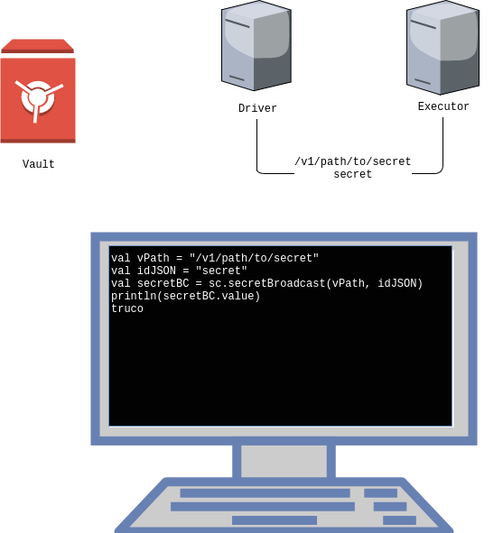

This feature allows the Spark jobs to securely use and transfer between driver and executors' secrets stored in Vault. Those secrets are stored as broadcast variables (learn more about it [in the official Spark documentation](https://spark.apache.org/docs/3.1.1/rdd-programming-guide.html#broadcast-variables)).

To use this feature, your Spark job must have the properties for Vault integration described in the [Spark user guide](../Spark.md) and **compile the job with the *Stratio Spark* version**.

Inside your job code, you need to specify two values:

* **Secret Vault path**: Vault path where to extract the secret.
* **JSON field to extract**: the key to extract from the secret in Vault.

These two values will be sent to the drivers and the executors:



When the code asks to extract the secret, the driver and the executor can individually access Vault to extract and use the secret:


To extract the secret in the code, you must use the **secretBroadcast** method defined in **sparkContext** (only available if compiling using *Stratio Spark*).

[box type="info"]The secret broadcast variables will always be stored as a <strong>String</strong>.[/box]

```scala
val secretVaultPath = "/v1/path/to/secret"
val jsonFieldToExtract = "secret"
val secret = sparkSession.sparkContext.secretBroadcast(secretVaultPath, jsonFieldToExtract)
println(s"My secret is ${secret.value}")
``` 
